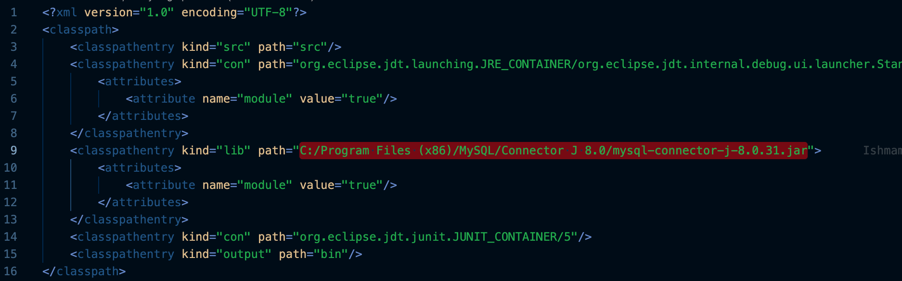

# COMP-4220_Project

### Development (On Eclipse)

1. Install [MySQL](https://dev.mysql.com/downloads/mysql/)
   - remember your root password
2. Install [JDBC Driver for MySQL](https://dev.mysql.com/downloads/connector/j/)
3. Open Project in Eclipse.
4. Edit .classpath, change path to where you downloaded the driver of step 2
   
5. In a terminal, run `mysql -h localhost -u root -p`. When prompted for your password, enter it.
6. Copy the contents of [the SQL file that will create your tables](./COMP4220-Project/SQL/ManagementDB_CreateTables.sql) and paste it into the terminal.
7. Copy the contents of [the SQL file that will create your records](./COMP4220-Project/SQL/ManagementDB_CreateTables.sql) and paste it into the terminal.
8. Run your Java files!
